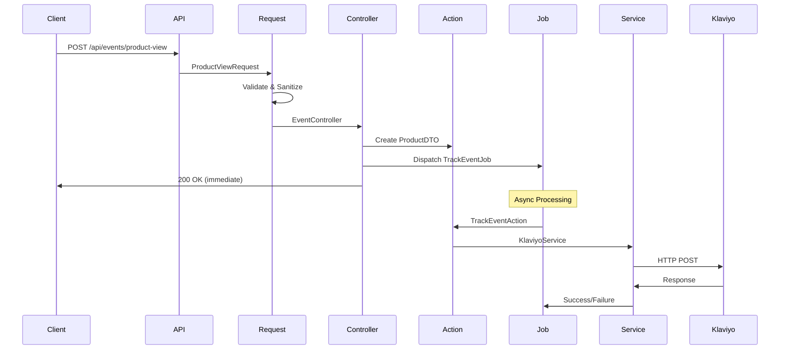
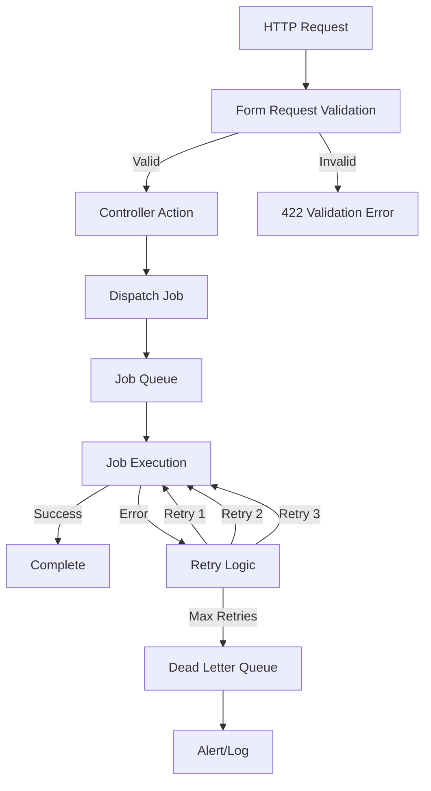

# Architettura del Sistema

Il servizio Klaviyo Event Service è progettato seguendo principi di **Clean Architecture** e **Domain-Driven Design** per garantire scalabilità, manutenibilità e testabilità.

## 🏗️ Panoramica Architetturale

### Layered Architecture

```
┌─────────────────────────────────────────────────────────────┐
│                    PRESENTATION LAYER                       │
│  ┌─────────────────┐  ┌─────────────────┐  ┌─────────────┐ │
│  │  HTTP Routes    │  │  Controllers    │  │ Middleware  │ │
│  │  - API Routes   │  │  - EventCtrl    │  │ - Auth      │ │
│  │  - Health       │  │  - CatalogCtrl  │  │ - CORS      │ │
│  └─────────────────┘  └─────────────────┘  └─────────────┘ │
└─────────────────────────┬───────────────────────────────────┘
                          │
┌─────────────────────────┴───────────────────────────────────┐  
│                   APPLICATION LAYER                         │
│  ┌─────────────────┐  ┌─────────────────┐  ┌─────────────┐ │
│  │ Form Requests   │  │    Actions      │  │    Jobs     │ │
│  │ - Validation    │  │ - Business      │  │ - Async     │ │
│  │ - Sanitization  │  │   Logic         │  │   Tasks     │ │
│  └─────────────────┘  └─────────────────┘  └─────────────┘ │
└─────────────────────────┬───────────────────────────────────┘
                          │
┌─────────────────────────┴───────────────────────────────────┐
│                    DOMAIN LAYER                             │
│  ┌─────────────────┐  ┌─────────────────┐  ┌─────────────┐ │
│  │      DTOs       │  │    Services     │  │   Events    │ │
│  │ - Data Transfer │  │ - Domain Logic  │  │ - Domain    │ │
│  │   Objects       │  │ - Orchestration │  │   Events    │ │
│  └─────────────────┘  └─────────────────┘  └─────────────┘ │
└─────────────────────────┬───────────────────────────────────┘
                          │
┌─────────────────────────┴───────────────────────────────────┐
│                 INFRASTRUCTURE LAYER                        │
│  ┌─────────────────┐  ┌─────────────────┐  ┌─────────────┐ │
│  │  HTTP Client    │  │   Queue Mgmt    │  │   Config    │ │
│  │ - Klaviyo API   │  │ - Redis/DB      │  │ - Env Vars  │ │
│  │ - Retry Logic   │  │ - Job Dispatch  │  │ - Services  │ │
│  └─────────────────┘  └─────────────────┘  └─────────────┘ │
└─────────────────────────────────────────────────────────────┘
```

---

## 🧩 Componenti Principali

### 1. **Presentation Layer**

#### HTTP Routes (`routes/api.php`)
- **Responsabilità**: Definizione endpoint API
- **Pattern**: RESTful API design
- **Features**:
  - Health check endpoint
  - Event tracking endpoints  
  - Catalog management endpoints
  - Middleware chain integration

#### Controllers
- **EventController**: Gestione eventi Klaviyo
- **CatalogController**: Sincronizzazione catalogo prodotti
- **Pattern**: Thin controllers che delegano ad Actions

#### Middleware
- **ValidateApiKey**: Autenticazione basata su API key
- **CORS**: Cross-Origin Resource Sharing
- **Rate Limiting**: Protezione da abuse

### 2. **Application Layer**

#### Form Requests
```php
App\Http\Requests\
├── Event\
│   ├── TrackEventRequest.php
│   ├── ProductViewRequest.php
│   └── OrderPlacedRequest.php
└── Catalog\
    ├── SyncCatalogRequest.php
    └── SyncSingleProductRequest.php
```

**Responsabilità**:
- Validazione input
- Sanitizzazione dati
- Autorizzazione requests
- Messaggi errore customizzati

#### Actions (Business Logic)
```php
App\Actions\Klaviyo\
├── TrackEventAction.php
├── IdentifyCustomerAction.php
├── DeleteProfileAction.php
└── SyncCatalogAction.php
```

**Pattern**: Command Pattern per incapsulare business logic

#### Jobs (Async Processing)
```php
App\Jobs\
├── TrackEventJob.php
├── IdentifyCustomerJob.php
└── SyncCatalogJob.php
```

**Features**:
- Retry logic con exponential backoff
- Dead letter queue handling
- Timeout management
- Error logging

### 3. **Domain Layer**

#### Data Transfer Objects (DTOs)
```php
App\DTO\Klaviyo\
├── CustomerDTO.php      # Dati cliente
├── ProductDTO.php       # Dati prodotto  
├── OrderDTO.php         # Dati ordine
└── EventDTO.php         # Evento Klaviyo
```

**Pattern**: Immutable DTOs con readonly properties

**Esempio DTO**:
```php
class CustomerDTO
{
    public function __construct(
        public readonly string $email,
        public readonly ?string $firstName = null,
        public readonly ?string $lastName = null,
        // ... altri campi
    ) {}

    public static function fromArray(array $data): self
    {
        return new self(
            email: $data['email'],
            firstName: $data['first_name'] ?? null,
            // ... mappatura dati
        );
    }

    public function toKlaviyoFormat(): array
    {
        // Conversione per API Klaviyo
    }
}
```

#### Domain Services
- **KlaviyoService**: Orchestrazione chiamate API Klaviyo
- **Pattern**: Service Layer per business logic complessa

### 4. **Infrastructure Layer**

#### HTTP Client
- **Guzzle HTTP** per chiamate API
- **Retry logic** automatico
- **Circuit breaker** pattern
- **Request/Response logging**

#### Queue Management
- **Redis** come message broker
- **Laravel Queue** per job processing
- **Horizon** per monitoring (opzionale)

---

## 🔄 Flusso dei Dati

### 1. Event Tracking Flow



### 2. Error Handling Flow



---

## 🏛️ Design Patterns Utilizzati

### 1. **Command Pattern**
- **Actions**: Ogni business operation è un comando
- **Jobs**: Async commands per operazioni background

### 2. **Data Transfer Object (DTO)**
- **Immutable objects** per trasferimento dati
- **Type safety** e validazione
- **Conversion methods** per formati diversi

### 3. **Repository Pattern** (Klaviyo Service)
- **Abstraction** delle chiamate API
- **Consistent interface** per data operations
- **Easy mocking** per testing

### 4. **Strategy Pattern** (Transformers)
- **Different transformation** strategies per event types
- **Runtime selection** di transformation logic

### 5. **Factory Pattern** (DTO Creation)
- **Static factory methods** per creazione DTOs
- **Centralized object creation** logic

---

## 📊 Scalabilità e Performance

### Horizontal Scaling

```
┌─────────────────┐    ┌─────────────────┐    ┌─────────────────┐
│   Web Server    │    │   Web Server    │    │   Web Server    │
│   Instance 1    │    │   Instance 2    │    │   Instance N    │
└─────────┬───────┘    └─────────┬───────┘    └─────────┬───────┘
          │                      │                      │
          └──────────────────────┼──────────────────────┘
                                 │
                    ┌────────────┴────────────┐
                    │    Load Balancer        │
                    │    (nginx/HAProxy)      │
                    └────────────┬────────────┘
                                 │
                    ┌────────────┴────────────┐
                    │      Redis Cluster      │
                    │    (Queue Storage)      │
                    └─────────────────────────┘
```

### Queue Workers Scaling

```
┌─────────────────┐    ┌─────────────────┐    ┌─────────────────┐
│  Queue Worker   │    │  Queue Worker   │    │  Queue Worker   │
│   Process 1     │    │   Process 2     │    │   Process N     │
└─────────┬───────┘    └─────────┬───────┘    └─────────┬───────┘
          │                      │                      │
          └──────────────────────┼──────────────────────┘
                                 │
                    ┌────────────┴────────────┐
                    │      Redis Queue        │
                    │   (Shared Message       │
                    │     Broker)             │
                    └─────────────────────────┘
```

### Performance Characteristics

| Component | Latency | Throughput | Scalability |
|-----------|---------|------------|-------------|
| **API Endpoints** | ~50ms | 1000+ req/s | Horizontal |
| **Queue Processing** | ~100ms | 500+ jobs/s | Horizontal |
| **Klaviyo API** | ~200ms | Rate Limited | Vertical |

---

## 🔧 Configuration Management

### Environment-Based Config

```php
// config/klaviyo.php
return [
    'api_key' => env('KLAVIYO_API_KEY'),
    'api_url' => env('KLAVIYO_API_URL', 'https://a.klaviyo.com/api'),
    'api_version' => '2024-10-15',
    
    'queue' => [
        'connection' => env('KLAVIYO_QUEUE_CONNECTION', 'redis'),
        'name' => env('KLAVIYO_QUEUE_NAME', 'klaviyo'),
    ],
    
    'retry' => [
        'attempts' => env('KLAVIYO_RETRY_ATTEMPTS', 3),
        'backoff' => [60, 300, 900], // 1min, 5min, 15min
    ],
];
```

### Service Container Bindings

```php
// app/Providers/AppServiceProvider.php
public function register(): void
{
    // Singleton per KlaviyoService
    $this->app->singleton(KlaviyoService::class);
    
    // Bind interfaces to implementations
    $this->app->bind(
        EventTrackingInterface::class,
        TrackEventAction::class
    );
}
```

---

## 🛡️ Security Architecture

### Authentication & Authorization

```
┌─────────────────────────────────────────────────────────────┐
│                    Security Layers                          │
├─────────────────────────────────────────────────────────────┤
│  1. Network Level                                           │
│     - HTTPS/TLS encryption                                  │
│     - Firewall rules                                        │
│     - VPN access (optional)                                 │
├─────────────────────────────────────────────────────────────┤
│  2. Application Level                                       │
│     - API Key authentication                                │
│     - Rate limiting                                         │
│     - Input validation & sanitization                      │
├─────────────────────────────────────────────────────────────┤
│  3. Data Level                                              │
│     - Encrypted sensitive data                              │
│     - Audit logging                                         │
│     - GDPR compliance features                              │
└─────────────────────────────────────────────────────────────┘
```

### API Security Flow

```php
// Middleware Pipeline
1. ValidateApiKey::class
   ↓ (validates X-API-Key header)
2. ThrottleRequests::class  
   ↓ (rate limiting)
3. FormRequest validation
   ↓ (input sanitization)
4. Controller action
```

---

## 📈 Monitoring & Observability

### Logging Strategy

```php
// Structured logging con context
Log::info('Klaviyo event tracked', [
    'event' => $event->event,
    'customer_email' => $event->customer?->email,
    'attempt' => $this->attempts(),
    'duration' => $duration,
    'memory_usage' => memory_get_usage(true),
]);
```

### Metrics Collection

- **Request/Response times**
- **Queue processing times**
- **Error rates e success rates**
- **Memory usage e CPU**
- **Klaviyo API response times**

### Health Checks

```php
// /api/health endpoint
{
    "status": "ok",
    "service": "klaviyo-integration", 
    "timestamp": "2025-10-15T10:30:00Z",
    "checks": {
        "database": "ok",
        "redis": "ok", 
        "klaviyo_api": "ok",
        "queue_size": 42
    }
}
```

---

## 🔮 Extensibility Points

### 1. **New Event Types**
```php
// Aggiungi nuovo DTO
class NewsletterSubscriptionDTO { ... }

// Aggiungi nuovo Action
class TrackNewsletterAction { ... }

// Aggiungi nuovo endpoint
Route::post('/events/newsletter', [EventController::class, 'newsletter']);
```

### 2. **Multiple Providers**
```php
// Interface segregation
interface EventTrackingInterface {
    public function track(EventDTO $event): bool;
}

// Multiple implementations
class KlaviyoEventTracker implements EventTrackingInterface { ... }
class SegmentEventTracker implements EventTrackingInterface { ... }
class MixpanelEventTracker implements EventTrackingInterface { ... }
```

### 3. **Custom Transformers**
```php
// Strategy pattern per transformazioni
interface EventTransformerInterface {
    public function transform(array $data): EventDTO;
}

class SyliusOrderTransformer implements EventTransformerInterface { ... }
class WooCommerceOrderTransformer implements EventTransformerInterface { ... }
```

---

## 📚 Best Practices Implementate

### SOLID Principles
- **S**: Single Responsibility - ogni classe ha un compito specifico
- **O**: Open/Closed - estendibile via interfaces e dependency injection
- **L**: Liskov Substitution - DTOs e interfaces sostituibili
- **I**: Interface Segregation - interfaces specifiche e focused
- **D**: Dependency Inversion - dipende da abstractions, non concrete

### Domain-Driven Design
- **Ubiquitous Language** - terminologia consistente (Event, Customer, Product)
- **Bounded Context** - clear boundaries tra domain concepts
- **Value Objects** - DTOs come immutable value objects

### Clean Code
- **Meaningful names** - nomi descriptivi per classi e metodi
- **Small functions** - funzioni con single responsibility
- **No magic numbers** - configurazioni esternalizzate
- **Error handling** - gestione errori consistente e logged